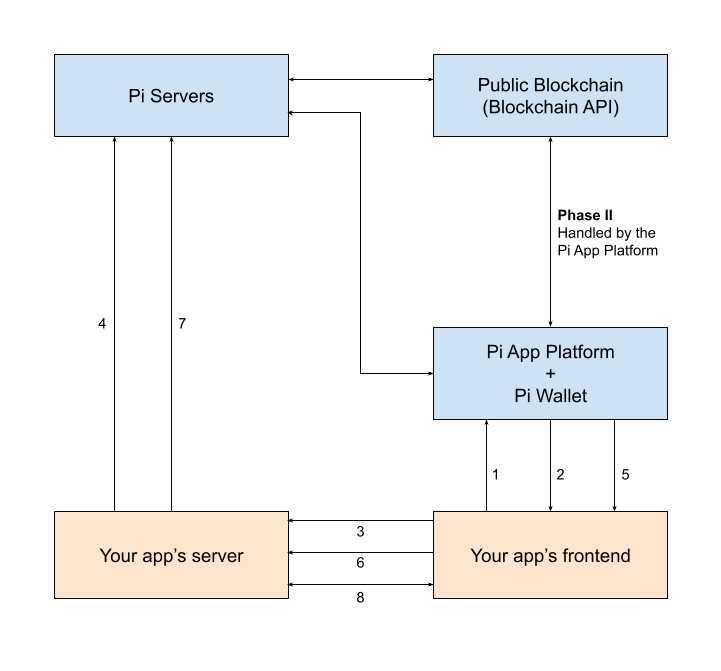

# 支付接口

支付接口是对区块链交易的封装，当用户在app中点击提交按钮去支付时，它确保了你的app、区块链和Pi Servers都是同步的。

这样简化了开发者与区块链之间交易细节，屏蔽掉了很多直接与区块链交互的技术细节。

## 支付流程

支付请求创建后, 会走3个主要的阶段:

1. 创建支付和服务端审批
2. 用户交互和区块链事务
3. 服务端完成

**阶段 I - 创建支付和服务端审批**

1. `createPayment`: 由你的app前端发起支付。支付流UI打开，但在你的app服务端验证支付前不能与之交互。

2. `onReadyForServerApproval`: JS SDK已经获得了支付id（PaymentID）

3. 将PaymentID传给你的app后端。这部分实现由你来完成。

4. 服务端审批: 你的app服务通过调用Pi Servers的`/approve`接口验证这笔支付。这决定了用户是否能够提交这笔交易到区块链上。

**阶段 II - 用户交互和区块链事务**

在这个阶段，支付对话框变成可交互并且允许用户确认交易，确认提交到区块链。

这个阶段你不需要做任何事，所有的一切都交给Pi Apps平台和Pi钱包来做。

在区块链事务提交后，支付流程不会结束。
在回到你的app前，你需要通过服务端去确认这笔支付。

**阶段 III - 服务端完成**

5. `onReadyForServerCompletion`: JS SDK发送区块链事务id（TxID）到你的app前端。TxID在服务端完成阶段会用到。

6. app前端发送TxID到app后端，这部分由你来实现。

7. 服务端完成: 你的app服务通过Pi Servers的`/complete`接口确认这笔支付已完成。这使您能够检查区块链事务是否实际发生，并让Pi知道这一点你知道的。

8. 支付流程关闭。再次回到你的app页面。
你的app前端和后端可以交换数据，并给用户展示一个确认洁面。这个实现取决于你。
Your app's server and your app's frontend can exchange data, and
update the app interface to show a confirmation screen to the user.
This implementation is your responsibility.

> **用户可能对你的app撒谎**
> 用户可能运行一个被`hack`的SDK，假装用户做了一个支付。如果在服务端完成阶段的API调用返回一个非200的错误码，请不要在你服务端将这笔支付标记为完成，并且不要交付任何用户买的东西。